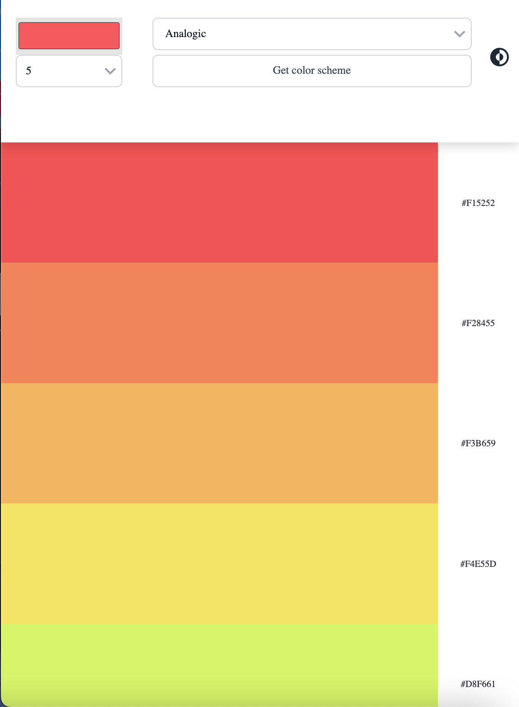
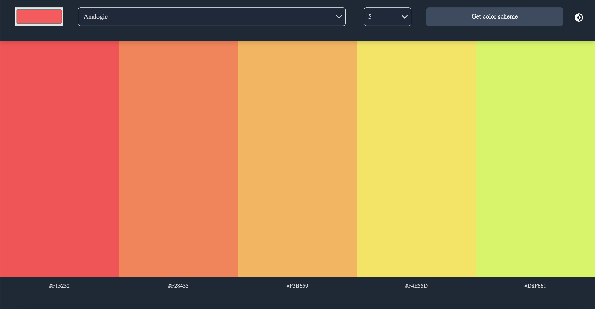
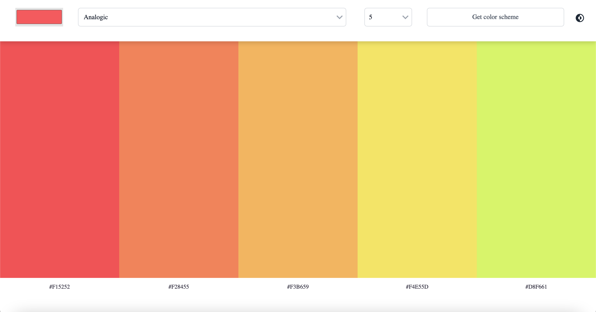

# Scrimba Challenge - Color Scheme Generator

This is a solution to the [Color Scheme Generator app challenge on scrimba](https://scrimba.com). Scrimba is a coding course platform that have interactive courses and tutorials.

## Table of contents

- [Overview](#overview)
  - [The challenge](#the-challenge)
  - [Screenshot](#screenshot)
  - [Links](#links)
- [My process](#my-process)
  - [Built with](#built-with)
  - [Useful resources](#useful-resources)
- [Author](#author)

## Overview

### The challenge

Users should be able to:

- Choose a "seed color" with an input type color
- Choose color scheme mode in a select box
- Clicking the button make request to the color API to get color scheme
- display the scheme colors and hex value on the page
- strech goal: click hex value or the color to copy to clipboard

### Screenshot

### Links

- Solution URL: [Solution URL here](https://github.com/idrisaltamimi/Color-Scheme-Generator.git)
- Live Site URL: [Live site URL here](https://idrisaltamimi.github.io/Color-Scheme-Generator/)

## My process

### Built with

- HTML5 
- CSS 
- Flexbox
- JavaScript

### Useful resources

 [ The Color API Docs](https://www.thecolorapi.com/docs#schemes).

## Author

- GitHub - [Idris Al Tamimi](https://github.com/idrisaltamimi)
- Twitter - [@idris_altamimi](https://twitter.com/idris_altamimi)
